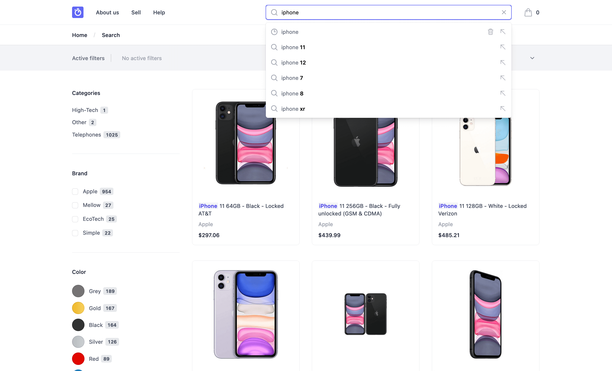

# Algolia DevCon 2022 | Storefront Demo JavaScript

This repository shows how to integrate a search and discovery experience into a Laravel and JavaScript storefront with Algolia. It is part of a the « *Integrate a search and discovery experience into a vanilla JavaScript storefront with Algolia* » live coding workshop presented at Algolia DevCon 2022.



## Requirements

To run this project, make sure you have [Docker](https://www.docker.com/) installed and running on your computer, as well as [Node.js](https://nodejs.org/) version 14.18+ and [Yarn](https://yarnpkg.com/).

## Get started

Open a Terminal prompt in the root directory of this project and type the following command:

```bash
make
```

This will install the necessary dependencies for both Laravel and the frontend code, and it will launch the dev server environment. Open [http://localhost](http://localhost) to see the application in your browser.

---

## Algolia DevCon

Algolia DevCon is an interactive 2-day developer conference dedicated to our engineering community.

At #AlgoliaDevCon you'll experience:
- 2 days of learning + innovation
- 15+ sessions, workshops and live coding sessions
- 500+ like minded developers in the Algolia community

Check out [algolia.com/devcon](https://www.algolia.com/devcon/) for more info.

> Disclaimer: The product dataset presented in this demo is the property of [BackMarket.com](https://www.backmarket.com/) and has been made available to Algolia solely for demonstration purposes only. You are not unauthorised to make any use of this data without explicit consent from [BackMarket.com](https://www.backmarket.com/).
